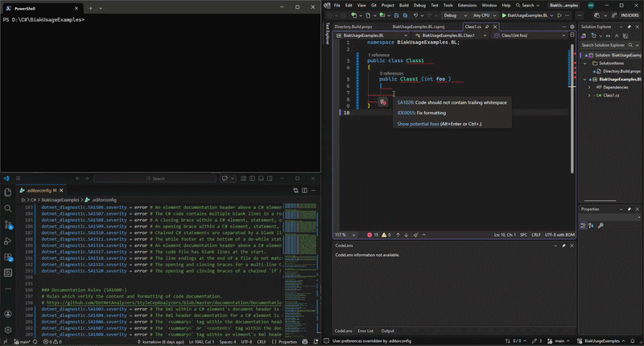

<div align="center">
 
 <h1>biak</h1>
 
 
 [](https://github.com/kurnakovv/biak/actions/workflows/build-and-tests.yml)
 [](https://github.com/kurnakovv/biak/actions/workflows/dotnet-format.yml)
 [](https://github.com/kurnakovv/biak/actions/workflows/inspect-code.yml)
 [](https://pvs-studio.com/en/pvs-studio/?utm_source=website&utm_medium=github&utm_campaign=open_source)
 [](https://github.com/kurnakovv/biak/actions/workflows/codeql.yml)
 [](https://app.codecov.io/gh/kurnakovv/biak)
 [](https://github.com/kurnakovv/biak/blob/dev/LICENSE)

 <!-- [](https://www.nuget.org/packages/kurnakovv.biak)
 [](https://www.nuget.org/packages/kurnakovv.biak) -->

 [](https://www.nuget.org/packages/kurnakovv.biak-preview)
 [](https://www.nuget.org/packages/kurnakovv.biak-preview)

</div>


## 📙 Description
👁️🟣👁️ biak is a C# tool for managing `.editorconfig` rules via a centralized, modular configuration with enable/disable modes, imports, variables, and conflict-aware formatting checks

## 📺 Preview

<!--  -->

<kbd></kbd>

## 💡 Features
* ⚙️ Enable / Disable `.editorconfig` rules | Change severity level ([what?](https://learn.microsoft.com/en-us/dotnet/fundamentals/code-analysis/configuration-options#severity-level)) with one command without losing the original values ([docs](https://github.com/kurnakovv/biak/wiki/Setup)).

* 🗂️ Imports | Import specific rule groups (e.g., CA / IDE / SA / Roslynator, etc.) from separate files or URLs for better organization and maintainability ([docs](https://github.com/kurnakovv/biak/wiki/Import)).

* 🔒 Always enabled rules | Override selected rules (e.g., formatting rules) so they remain active even when you run the disable command (soon 🔜).

* 📦 Variables | Extract duplicate strings (e.g., file paths) into reusable variables ([docs](https://github.com/kurnakovv/biak/wiki/Variables)).

* 🔎 Include / Exclude filter | Apply rules to all C# `[*.cs]` files except selected ones, e.g., `[{TestClass1.cs,TestClass2.cs}]` ([docs](https://github.com/kurnakovv/biak/wiki/IncludeExcludeFilter)).

* 🧑‍💻 Find activity | Provides the ability to find active branches and files being modified within them. This feature helps gradually introduce formatting and analyzers without causing Git conflicts by excluding actively modified files from the `.editorconfig` file ([docs](https://github.com/kurnakovv/biak/wiki/FindActivity)).

* ⚔️ Find conflicts | Find files with merge conflicts between the default branch and selected branches. This is especially useful for legacy projects with many rule violations, allowing gradual integration without major conflicts ([docs](https://github.com/kurnakovv/biak/wiki/FindConflicts)).

* 🚧 Warnings baseline | Build a warning baseline from existing compiler and analyzer warnings, allowing [TreatWarningsAsErrors](https://learn.microsoft.com/en-us/dotnet/csharp/language-reference/compiler-options/errors-warnings#treatwarningsaserrors) to be enabled without fixing all legacy violations at once ([docs](https://github.com/kurnakovv/biak/wiki/WarningsBaselineOverview)).

## 🚀 Quick start
1️⃣ Install
```
dotnet tool install --global kurnakovv.biak
```

2️⃣ Check
```
dotnet biak
```
Output
```
       __________________________________
      | Hi, I'm biak!                    |
      | I was made by kurnakovv          |
      | To work with .editorconfig       |
      |__________________________________|
                                          \
                                           \
                           WWNNWWWWWWWWWWNNNXXXXXXXXXNNWWW
                        WNKOkdlodOXXK0Okxdollccc:cccclodxOKXNNW
                       W0ooxo;'.,colc:;;::;,,,,''''.....',;cldOKXNNK000XNW
                      WKo,'''.':l:,;cokO00Oo:;;;;,,''.......;:;:oxxl:ddclkXW
                     WW0l'..',,:c:ckKNNNX0xc;;,,,,,'''......,;,..';:;;,'.,oKW
                  WX0kxxdc,''.'cddok00Oxdc:;;,,,,,'''...............',,'..:ON
                WXkxo;',:,...'cxko:::::;;;;,,,,''''''.................,;;;l0W
                Xd;;;',,.',;;;;::;;;;;;;,,,,,'''''''...................':okXW
               WKl'.','..;l:,,,,'''',,,,,,'''''''''......................;o0XW
                Nkc:;'...''''... .,;..'''''''''''.........''.   ..........;o0XW
                WXOo'........   .kNNo...''''''...........dXKc     .........;o0NW
                NKx,........    .:do,  ................ .;ol'      .........;dKNW
               WXk:.........           ................            ..........:xKN
              WN0l..........           ................            ..........'cOXW
              NKx;........''..        ..................      .,...'..........,dKNW
             WN0l........',co:...  .......................    ..'co:'..........cOXW
             NKx;.........',:;,'...........'...................',;;,...........,o0NW
            WXOl..............................'.................................:kKN
           WN0d,.......................................................  .......'lOXNW
         WNXOo;....   ................................................  .....  ..,oOKXXNW
       WNKkdc:,....    .............................................    ....    ..;ldxxdOKNW
     WKkolodxl;'..      .........................................        .        .',,,',lkKW
    NOl;;lxOkl,..        .....................................             ....    .......;d0W
   NOc..,;;;,....... ..,:::;...........................      .     ....   ...... .'..   ...;xX
   Xx;..........;,....cdddoc,.............               ........,:lll:,.......  ....   ...;dX
   NOl'.........''.....',''...........                 .........'cxkkkd:'''.... ..........;lON
    NOl;'.........................................................',,,'.',............'';cd0N
     WXOdl:;,,,,,,'..........................................';,................',;:clodkKNW
       WWNXK0Okxddlcc::;;,,,'''.............................',;;,,,,,,,,,,,,,;:cox0KXXNWW
              WWNXK0kkxddollcc::;;,,,''....................',;:cclllllooooddxk0KNW
                    WWNNXXK00OOkkkkxxxxdddddddddddddddddddxxkkkOOO0000KKXXNNWW
                              WWWWWWWWWWNNNNNNNNNNNNNNNNWWWWWWWW


                                                                  ___________________________________
                                                                 | GitHub                            |
                                                                 | https://github.com/kurnakovv/biak |
                                                                 |                                   |
                                                                 | Need help?                        |
                                                                 | dotnet biak --help                |
                                                                 |___________________________________|
```

3️⃣ Setup ([docs](https://github.com/kurnakovv/biak/wiki/Setup))
```
dotnet biak setup
```

> [!NOTE]
> Run this command in the same directory where the `.editorconfig` file is located.

4️⃣ Enable ([docs](https://github.com/kurnakovv/biak/wiki/Enable)) / Disable ([docs](https://github.com/kurnakovv/biak/wiki/Disable))
```
dotnet biak enable
dotnet biak disable
```

That's it - biak is configured. Happy coding! 🚀

If you need more details, please visit the Wiki 📚 ([where?](https://github.com/kurnakovv/biak/wiki))

> [!WARNING]
> If you install `kurnakovv.biak-preview` ([what?](https://www.nuget.org/packages/kurnakovv.biak-preview/)) use `dotnet biak-preview` instead of `dotnet biak`

## ❔ Why
In large projects with a significant number of files, `.editorconfig` rules may be evaluated with noticeable delay.

After modifying or fixing a rule, the validation result may not update immediately - sometimes taking several seconds (or even longer). During that time, it's unclear whether:

* The rule has been fixed correctly?
* The configuration was not applied?
* The IDE is stuck?

Or it's simply input lag?

This delay creates uncertainty and slows down development. Developers may re-check their changes multiple times or look for issues that don't actually exist.

Our team encountered this exact problem in a real-world project. The need to eliminate this delay and make `.editorconfig` behavior more predictable became the primary motivation for building this tool.

This tool allows you to temporarily enable or disable specific `.editorconfig` rules, simplifying debugging, speeding up feedback, and reducing cognitive overhead.

### Subquestions
* Why not just change the level through any replacer (`error`, `warning`, `suggestion` <-> `none`)? | Firstly, it's not very convenient; secondly, when you want to turn the rules back on, the replacer might replace the lines incorrectly (for example, you need `none` to remain somewhere, but it will change it); thirdly, it's not so easy to integrate in the CI/CD system.

* Why not add the `.editorconfig` file on CI/CD startup? | Some rules are enabled by default, for example [IDE0290](https://learn.microsoft.com/en-us/dotnet/fundamentals/code-analysis/style-rules/ide0290), and you want to keep them disabled all the time. In this case, if there is no `.editorconfig` file, you won't be able to do this.

* Why not create two `.editorconfig` files (one with rules enabled, one disabled)? | This would require duplicating values in two places, which is error-prone and harder to maintain.

## 🗣️ Recommendations
* Set up CI/CD integration (e.g., using GitHub Actions ([how?](https://github.com/kurnakovv/biak/wiki/EnableDisableGitHubAction))) to improve reliability and consistency, since not everyone will run this tool locally.

* If you configure this tool through CI/CD, make sure to periodically validate the rules locally as well. Rules may be misconfigured accidentally, so you should verify what is generated in the `.editorconfig` file. Additionally, not all rules are enforced by `dotnet build`; some may only appear within the IDE (for example, Visual Studio).

## ⭐ Give a star
I hope this tool is useful for you, if so, please give this repository a star, thank you :)

## SAST Tools

[PVS-Studio](https://pvs-studio.com/en/pvs-studio/?utm_source=website&utm_medium=github&utm_campaign=open_source) - static analyzer for C, C++, C#, and Java code.
